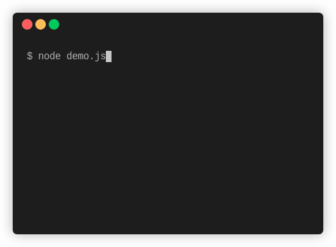

<div align="center">

# @open-tech-world/node-cli-progress



</div>

> CLI spinner with task progress result.

## Installation

Using npm

```shell
npm install @open-tech-world/node-cli-progress
```

Using Yarn

```shell
yarn add @open-tech-world/node-cli-progress
```

## Usage

```ts
import { cliProgress } from '@open-tech-world/node-cli-progress';

const progress = new cliProgress();
progress.start();
setTimeout(() => {
  progress.update('Downloading');
}, 1000);
progress.done('Download completed!');
```

## API

`new cliProgress(stream?: NodeJS.WriteStream)`

It creates a new instance of the cliProgress. 

Default `stream` is `process.stderr`.

#### Instance methods:

**start(text?: string)**

This method starts the spinner with optional `text`.

**update(text: string)**

This method updates the `current text` with the given `text`.

**done(text?: string)**

This method stops the spinner and mark the task as `success` with optional `text`.

**fail(text?: string)**

This method stops the spinner and mark the task as `failed` with optional `text`.

**warn(text?: string)**

This method stops the spinner and mark the task as `warning` with optional `text`.

**info(text?: string)**

This method stops the spinner and mark the task as `info` with optional `text`.

## License

Copyright (c) 2021, [Thanga Ganapathy](https://thanga-ganapathy.github.io) ([MIT License](./LICENSE)).
